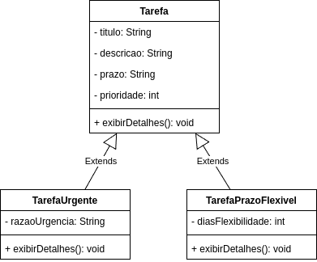

# Herança e Polimorfirmo

## Herança

### Detalhes:
- **Definição:**
  - **O que é:** Herança permite que uma classe herde atributos e métodos de outra classe, promovendo reutilização de código e hierarquia de classes.
  - **Objetivo:** Facilitar a criação de novas classes a partir de classes existentes.

  - **Exemplo Real:** Imagine que temos diferentes tipos de tarefas (como "TarefaUrgente" ou "TarefaComPrazoFlexível"). Em vez de repetir código, essas classes podem herdar a base da classe `Tarefa` e adicionar ou modificar comportamentos.

- **Aplicação ao Projeto:**
  - Criaremos classes que herdam de `Tarefa`, permitindo especializações e funcionalidades adicionais.

* **Objetivo**: Faciliar a criação de novas classes a partir de classes existentes.

- **Discussão:**
  - **Ponto Chave:** A classe `TarefaUrgente` herda todos os atributos e métodos da classe `Tarefa`, mas podemos adicionar novos atributos e sobrescrever métodos.

- **Definição de Construtores nas Classes Filhas:**
  - A classe filha deve chamar o construtor da classe pai usando `super()`, passando os parâmetros necessários para inicializar a classe base.

## Polimorfismo

#### Detalhes:
- **Definição:**
  - **O que é:** Polimorfismo permite que objetos de diferentes classes filhas sejam tratados como objetos da classe pai, proporcionando flexibilidade na programação.
  - **Objetivo:** Permitir que métodos e atributos sejam sobrescritos para criar comportamentos diferentes em classes derivadas.

- **Exemplo Prático:**
  - Podemos criar um array de objetos do tipo `Tarefa`, onde cada elemento pode ser uma `Tarefa`, `TarefaUrgente`, ou outra classe que herda de `Tarefa`.

- **Discussão:**
  - **Ponto Chave:** O polimorfismo permite que o método `exibirDetalhes()` seja chamado para diferentes tipos de tarefas, resultando em comportamentos distintos.
