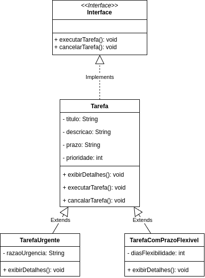

# Interfaces

## Interfaces

### Detalhes
* Definição:
  * O que é: Uma interface é um contrato que define um conjunto de métodos que uma classe **deve** implmentrar. Ao contrário da herança de classes, a interface **não** fornece implementação, apenas a _assinataura_ dos métodos.
  * Objetivo: Promover o descaomplamento do cósigo, permitindo que difentes classes implentem o mesmo conjunto de métodos de maneiras diferentes.

  * Criar interface chamada `AcoesTarefa` que define operações básicas como `executarTarefa()` e `cancelarTarefa()`.

  