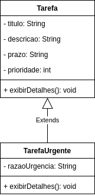

# Herança e Polimorfirmo

* **Definição**: Herança permite que uma classe herde atributos e métodos de outra classe, provendo reutilização de código e hierarquia de classes.

* **Objetivo**: Faciliar a criação de novas classes a partir de classes existentes.

## Polimorfismo
* **Definição**: Polimorfismo permite que objetos de diferentes clases _filhas_ sejam tratados como objetos da classe _pai_, proporcionando flexibilidade na programação.
* **Objetivo**: Permitir que métodos e atributos sejam sobreescritos para criar comportamentos diferentes em classes derivadas.